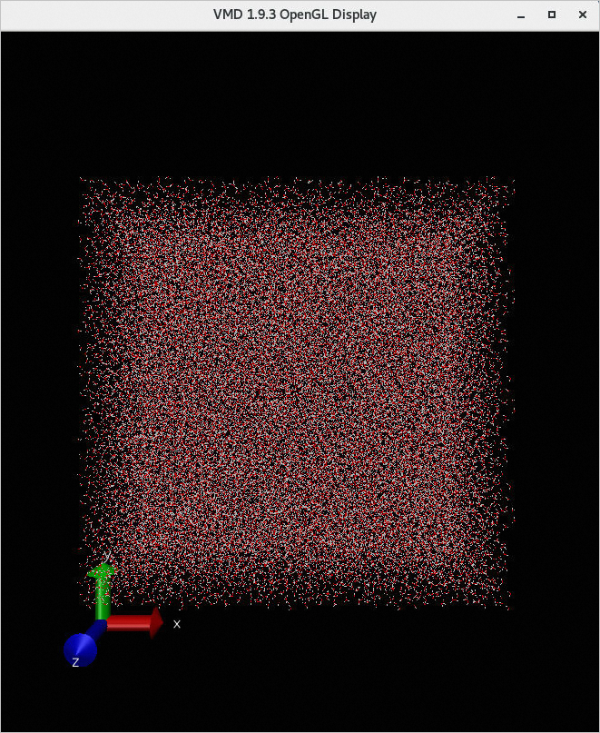

<h1> Rapid deployment AlphaFold2 Ehpc compute nest </h1>

<blockquote>

<strong> Disclaimer:</strong> This service is provided by a third party. We try our best to ensure its security, accuracy and reliability, but we cannot guarantee that it is completely free from failure, interruption, error or attack. Therefore, the company hereby declares that it makes no representations, warranties or commitments regarding the content, accuracy, completeness, reliability, suitability and timeliness of the Service and is not liable for any direct or indirect loss or damage arising from your use of the Service; for third-party websites, applications, products and services that you access through the Service, do not assume any responsibility for its content, accuracy, completeness, reliability, applicability and timeliness, and you shall bear the risks and responsibilities of the consequences of use; for any loss or damage arising from your use of this service, including but not limited to direct loss, indirect loss, loss of profits, loss of goodwill, loss of data or other economic losses, even if we have been advised in advance of the possibility of such loss or damage; we reserve the right to amend this statement from time to time, so please check this statement regularly before using the Service. If you have any questions or concerns about this Statement or the Service, please contact us. 

</blockquote>

<h2> Overview </h2>

AlphaFold2 is a deep learning model made in DeepMind for protein structure prediction. This article introduces the rapid deployment AlphaFold2 of Alibaba Cloud ehpc Nvidia GPU specifications and computing nest. 

<h2> Prerequisites </h2>

 When your account is a RAM account, you need to access and create some Alibaba Cloud resources. Therefore, your account must contain permissions for the following resources. 

<table>
<thead>
<tr>
<th> Permission policy name </th>
<th> Remarks </th>
</tr>
</thead>
<tbody>
<tr>
<td>AliyunECSFullAccess</td>
<td> Permissions to manage ECS </td>
</tr>
<tr>
<td>AliyunESSFullAccess</td>
<td> Permissions to manage the Elastic Scaling Service (ESS) </td>
</tr>
<tr>
<td>AliyunRDSFullAccess</td>
<td> Permissions to manage ApsaraDB for RDS </td>
</tr>
<tr>
<td>AliyunVPCFullAccess</td>
<td> Permissions for managing VPC networks </td>
</tr>
<tr>
<td>AliyunROSFullAccess</td>
<td> Manage permissions for Resource Orchestration Services (ROS) </td>
</tr>
<tr>
<td>AliyunComputeNestUserFullAccess</td>
<td> Manage user-side permissions for the compute nest service (ComputeNest) </td>
</tr>
</tbody>
</table>

<h2> Billing instructions </h2>

 the cost of AlphaFold2 community edition deployment in computing nest mainly involves:

<ul>
<li> Elastic High Performance Computing Cluster (EHPC) fees </li>
<li> File System (NAS) fees </li>
<li> Traffic bandwidth charges </li>
</ul>

<h2> Deployment Architecture </h2>

<ul>
<li> The deployment consists of an ehpc cluster, which includes one manager node and multiple compute nodes </li>
<li>manager and compute nodes are deployed on ecs, compute of which contains gpu cards </li>
<li> The service uses nas-cpfs to build a high-performance shared file system </li>
</ul>

<h2> Parameter description </h2>

<table>
<thead>
<tr>
<th> Parameter group </th>
<th> Parameter item </th>
<th> Description </th>
</tr>
</thead>
<tbody>
<tr>
<td> Service instance </td>
<td> Service instance name </td>
<td> It must be no more than 64 characters in length and must start with an English letter. It can contain numbers, English letters, dashes (-), and underscores (_). </td>
</tr>
<tr>
<td></td>
<td> Region </td>
<td> Region where the service instance is deployed </td>
</tr>
<tr>
<td></td>
<td> Payment type </td>
<td> Billing type of resources: pay by two and package year and month. </td>
</tr>
<tr>
<td>EHPC cluster configuration </td>
<td> Cluster logon password </td>
<td> is 8-30 in length and must contain three items (uppercase letters, lowercase letters, numbers, ()'~!@#$%^& *-+ =|{}[]:' <>,./special symbols)</td>
</tr>
<tr>
<td></td>
<td>Ehpc deployment mode </td>
<td>Tiny,Simple,Standard</td>
</tr>
<tr>
<td></td>
<td> Compute node instance type </td>
<td> Specifications of compute nodes available in the zone </td>
</tr>
<tr>
<td></td>
<td> Calculate the number of nodes </td>
<td> Number of computing nodes, optional value: 1-99</td>
</tr>
<tr>
<td></td>
<td> Login node instance type </td>
<td> Specifications of logon nodes available in the zone </td>
</tr>
<tr>
<td></td>
<td> Number of control nodes </td>
<td> Number of control nodes, optional values: 1,2,4</td>
</tr>
<tr>
<td>EHPC login configuration </td>
<td> Login user name </td>
<td></td>
</tr>
<tr>
<td></td>
<td> Login user password </td>
<td> is 8-30 in length and must contain three items (uppercase letters, lowercase letters, numbers, ()'~!@#$%^& *-+ =|{}[]:' <>,./special symbols)</td>
</tr>
<tr>
<td> Network configuration </td>
<td> Availability Zone </td>
<td> Zone where the ECS instance is located </td>
</tr>
<tr>
<td></td>
<td>VPC ID</td>
<td> VPC where the resource is located </td>
</tr>
<tr>
<td></td>
<td> Switch ID</td>
<td> Switch where the resource is located </td>
</tr>
</tbody>
</table>

<h2> Deployment process </h2>

<ol>
<li>
 Visit Compute Nest AlphaFold2 Community Edition <a href = "https://computenest.console.aliyun.com/user/cn-hangzhou/serviceInstanceCreate?ServiceId=service-3b7139109894484eb0a4"> Deployment link </a>
, fill in the deployment parameters as prompted:

</li>
<li>
 after the parameters are filled in, you can see the corresponding inquiry details. after confirming the parameters, click <strong> next: confirm the order </strong>.

</li>
<li>
 Confirm the order and agree to the service agreement and click <strong> Create now </strong>
Enter the deployment phase. The deployment will take several hours, and the download data will be slow. The log of the download output is stored in/root/download.log

</li>
<li>
 Wait for the data to be downloaded before you can start using the service. You can go to <a href = "https://www.predictioncenter.org/casp14/targetlist.cgi">CASP14</a>
Copy <a href = "https://www.predictioncenter.org/casp14/target.cgi?target=T1050&view=sequence"> sample data </a> of T1050 in
Store it in/home/alphafold/T1050.fasta, log on to the cluster through ehpc<a href = "https://help.aliyun.com/zh/e-hpc/user-guide/log-on-to-a-cluster?spm=a2c4g.11186623.0.0.3 dff56fdLxmQbl#section-wl8-aio-0wu"> console </a>, and enter the username and password to log on. 
</li>
<li>
 Then go to ehpc console task management to execute the command. 
</li>
</ol>

<pre><code> -- /usr/bin/python3 /home/share/alphafold/docker/run_docker.py --fasta_paths=/home/alphafold/T1050.fasta --max_template_date=2020-05-14 --data_dir=/home/data --docker_image_name=alphafold:latest --output_dir=/home/alphafold
</code></pre>

<ol start="7">
<li>
 Check ehpc task status and wait for several hours before discovering
The/home/alphafold/directory generates the corresponding log (T1050.e1) and results (T1050 folder). Go to the T1050 folder and copy rank_0.pdb. 
</li>
<li>
 in protein structure prediction results <a href = "https://www.ncbi.nlm.nih.gov/Structure/icn3d/full.html"> website </a>
Open rank_0.pdb in and you will see the corresponding protein structure. 
</li>
</ol>
